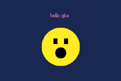
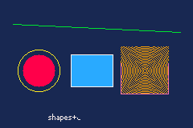

# GBA Lua SDK

Make games for the **Game Boy Advance** by writing a **PICO-8-flavored Lua**
instead of C or ARM assembly.

The SDK compiles your Lua to C, builds it with a bundled ARM toolchain against a
libtonc + maxmod runtime, and produces a `.gba` ROM that runs in
[mGBA](https://mgba.io/) and on real hardware. No interpreter, no VM: your Lua
becomes native ARM machine code.

If you know PICO-8 you'll feel at home (`spr`/`btn`/`_init`/`_update`/`_draw`,
Lua syntax) - but this SDK leans into what the GBA can do that a fantasy console
can't: **128 hardware sprites, rotate/scale (affine) sprites, four scrolling tile
layers, Mode 7, hardware windows, alpha blending and fades, mosaic, per-scanline
raster effects, battery saves, and streamed module music.** Familiarity, not
compatibility.

This is a fork of the [GameTank Lua SDK](https://github.com/monteslu/gametank_lua_sdk);
it reuses that compiler front-end and PICO-8 number model, and retargets the
back end to native ARM.

## Your first game

A complete GBA game - one `main.lua`, no assets:

```lua
-- The screen is 240x160. cls clears it; print and the shapes draw on top.
-- Colors are PICO-8-style indices 0-15 (0 black, 1 dark-blue, 10 yellow, 14 pink).
function _draw()
  cls(1)                                -- dark blue background

  print("hello gba", 100, 24, 14)       -- title text, pink, near the top

  circfill(120, 92, 38, 10)             -- head: a big yellow circle
  rectfill(106, 76, 113, 86, 0)         -- left eye: a black square
  rectfill(127, 76, 134, 86, 0)         -- right eye
  circfill(120, 104, 11, 0)             -- mouth: a black circle
end
```

<p align="center">
  
</p>

Build it to a `.gba` ROM:

```sh
node bin/gbalua.js build examples/hello/main.lua -o hello.gba
```

Then run `hello.gba` in [mGBA](https://mgba.io/) (or any GBA emulator), or flash
it to a cartridge. That's the whole loop: write `main.lua`, build the `.gba`,
ship it.

Colors are PICO-8-style indices `0-15` (`0` black, `1` dark-blue, `10` yellow,
`14` pink); `pal()` / `spr_col()` reach the full 15-bit BGR555 palette (32768
colors) at runtime when you want more.

## Requirements

- [Node.js](https://nodejs.org/) **24+**
- **nothing else** — `npm install` brings the whole toolchain as dependencies:
  arm-gcc + libtonc + maxmod, all **as WebAssembly** (via
  [`romdevtools`](https://www.npmjs.com/package/romdevtools) /
  `romdev-platform-gba`). No devkitPro, no native tools to build or install.

The build runs the WASM toolchain in-process (`cc1-arm` → `as` → `ld` →
`objcopy`) — no server, no daemons. It can also talk to a running romdev
server instead (`GBALUA_BACKEND=mcp`, faster for rapid rebuilds since the
server keeps warm toolchain workers). See `compiler/build-gba.mjs`.

## The screen and the two rendering modes

The GBA screen is **240×160**. Two ways to draw, and they are one either-or (a
hardware mode bit); sprites, sound, and all the color effects compose over both.

- **Tile mode (Mode 0)** - the real game path. Four hardware tile layers that
  scroll for free, plus 128 hardware sprites on top. This is how scrolling GBA
  games work; it's what the flagship example (`starfall`) uses.
- **Bitmap mode (Mode 4)** - an immediate-mode 8bpp framebuffer for
  `pset`/`rect`/`circ`/`line` + text. Simplest to start with (the hello above),
  single-buffered, slower per-pixel. Sprites still compose on top.

You don't pick a mode explicitly - using tile-layer verbs (`map_show`,
`tileset`, `layer_*`, `mode7`) puts you in tile mode; the immediate draw verbs
use bitmap mode.

## The PICO-8 contract

Define `_update60()` (60 fps) or `_update()` (30 fps), plus `_draw()`, and
optionally `_init()`. The runtime latches input before each update and ends the
frame after `_draw()` (OAM flush, vblank).

**Numbers are PICO-8 numbers**: 16.16 fixed point. `sin`/`cos`/`atan2` use turns
(0..1) with PICO-8's screen-space-inverted sin. The compiler infers which values
stay integral and keeps them in fast 32-bit ints - an optimization, never a
semantic change.

**The dialect** keeps PICO-8's syntax: `+=`-style compound assignment, one-line
`if (cond) stmt` / `while (cond) stmt`, `!=`, `\` floor division, `//` comments,
hex/binary literals with fractions, and multiple assignment (`x, y = 64, 32`).

**Arrays are 1-indexed** (Lua/PICO-8 style): `a = array(8)`, then `a[1]` is the
first element (`a[0]` is out of bounds).

## API at a glance

| | |
|---|---|
| lifecycle | `_init` `_update` `_update60` `_draw` |
| bitmap draw | `cls` `camera` `color` `pset` `pget` `sset` `clip` `rect` `rectfill` `circ` `circfill` `line` |
| 16-bit bitmap | `mode15()` true color · `rgb15(r,g,b)` · `cls15` `pset15` `flip15` - a 160×128 BGR555 framebuffer |
| sprites | `spr(n,x,y,[w,h],[fx,fy])` hardware OBJ · `spr8(t,x,y,[flip])` · `spr_pal` `spr_prio` |
| affine sprites | `sprr(n,x,y,angle,scale)` rotate+scale · `sprr2(n,x,y,angle,sx,sy)` non-uniform |
| tile layers | `map_show` `tileset` `tilemap` `layer_show` `layer_pri` `layer_scroll` `parallax` `camera` `mget`/`tget`/`tset` |
| mode 7 | `mode7()` · `mode7_cam(x,y,angle,[zoom])` · `mode7_off()` - an affine plane on BG2 |
| affine BG | `abg_setup(tiles,ntiles,map,msize,[pal])` · `abg_cam(x,y,angle,[zoom])` · `abg_off()` - your own rotate/scale layer |
| windows | `window(x0,y0,x1,y1)` spotlight · `window_inside`/`window_outside`/`window_obj` · `window_off` |
| color effects | `fade(amount,[white])` · `blend(layer,alpha)` · `blend_off` · `mosaic`/`mosaic2` · `backdrop` · `screen_off`/`screen_on` |
| palette | `pal(i,r,g,b)` BG · `spr_col(i,r,g,b)` OBJ · `hgradient(table)` per-scanline backdrop |
| animation | `anim(slot,first,last,fps)` loop · `anim_once` · `anim_pingpong` · `anim_reset` · `anim_done` |
| input | `btn(i,[pl])` `btnp(i,[pl])` - 0-3 d-pad, 4=A, 5=B, 6=L, 7=R, 8=START, 9=SELECT |
| math | `flr` `ceil` `abs` `sgn` `sqrt` `min` `max` `mid` `sin` `cos` `atan2` `rnd` `srand` `t`/`time` + bit ops |
| data | `array(n,[v])` 16.16 · `array8(n,[v])` bytes 0-255 · `pool(n)` · `dma(dst,src,n)`/`dma_fill` fast moves |
| save | `save(slot,array8,n)` · `load(slot,array8,n)` - battery SRAM, 16 slots × 1 KB |
| timer | `timer_start()` · `timer_read()` - free-running Timer 3, sub-frame profiling |
| sound | `music(n,[loop])` module music · `sfx(n,[ch])` · `sfx_ex(n,vol,pan,pitch)` · `sfx_volume` |

See **[docs/CHEATSHEET.md](docs/CHEATSHEET.md)** for every verb with signatures.

## Assets

`--sheet sprites.png` imports a sprite sheet, `--map level.png` a tilemap, and
`--mode7 plane.png` an affine plane, via a self-contained PNG → tile converter
(`compiler/png-tiles.mjs`). All three also accept the formats artists actually
work in — **Aseprite** (`.ase`/`.aseprite`, frame 0 flattened) and **Tiled**
(`.tmx`, visible layers composited; embed the tileset in the map) — imported,
never re-invented. They're CLI flags on `build`:

```sh
node bin/gbalua.js build --target gba mygame/main.lua \
  --sheet mygame/sprites.ase --map mygame/level.tmx -o mygame/game.gba
```

The `examples/` directory shows each subsystem in use:

<p align="center">
  
</p>

| example | shows |
|---|---|
| `showcase` | a scene-cycling tour of the whole feature set (L/R to switch scenes) |
| `starfall` | a complete shmup - tile mode, sprite HUD, module music + SFX |
| `effects` | `blend` / `fade` in bitmap mode |
| `mode7` | an affine plane you rotate, zoom, and drive over |
| `windows` | a hardware spotlight over the Mode 7 plane |
| `anim` | frame-range animation helpers |
| `hwtest` | `hgradient` raster gradient, SRAM `save`/`load`, the `timer` |

## Sound

Music is a streamed module (maxmod), and SFX are sampled one-shots - trigger
both by index, PICO-8 style:

```lua
function _init()
  music(0)                       -- start module 0, looping
end
function _update60()
  if btnp(4) then sfx(0) end      -- A -> a sound effect
  if btnp(5) then sfx_ex(1, 512, 200, 1.5) end  -- B -> louder, panned, +pitch
end
```

`music(-1)` stops; `music(n, false)` plays once. `sfx_ex(n, vol, pan, pitch)`
gives per-shot volume (0-1024), pan (0-255, 128 center), and pitch (a 16.16
multiplier); `sfx_volume(v)` sets the master SFX level.

Bring your own music with `--music song.xm` on `build` (repeatable —
`music(0)` plays the first module, `music(1)` the second, …; `.xm`/`.mod`/
`.it`/`.s3m` all work). The soundbank is compiled at build time by
`romdev-maxmod`, a faithful pure-JS port of devkitPro's `mmutil`. Or link a
prebuilt bank with `--soundbank bank.bin`. With neither flag, the default
soundbank (`assets/soundbank.bin`) ships a chiptune as module 0.

## Not-Lua walls (loud, never silent)

Conditions must be boolean (`if x ~= 0 then`, not `if x then` - Lua calls 0
truthy, C doesn't, and the compiler refuses to guess). No `nil`, closures,
metatables, coroutines, string concatenation, or `goto`. Every unsupported
feature is a compile-time error that says what to write instead.

## Repo layout

`compiler/` Lua→C compiler + the GBA build driver (`build-gba.mjs`) and PNG
importer (`png-tiles.mjs`) · `gba-sdk/` the C runtime (thin libtonc/maxmod
wrappers: `gba_api.c` frame+sprites+input, `gba_bg.c` tile layers, `gba_mode7.c`,
`gba_win.c`, `gba_fx.c` effects, `gba_sound.c`, `gba_hw.c` save+timer,
`gba_text.c`, `gba_anim.c`, `gba_math.c`) · `assets/` the default soundbank +
its generators · `bin/gbalua.js` CLI · `examples/`.

## Docs

| doc | what |
|---|---|
| [docs/CHEATSHEET.md](docs/CHEATSHEET.md) | the full GBA Lua API reference |
| [docs/CHEATSHEET_FOR_PICO8_USERS.md](docs/CHEATSHEET_FOR_PICO8_USERS.md) | per-function PICO-8 → GBA map |

## License

MIT. `gba-sdk/` wraps [libtonc](https://github.com/devkitPro/libtonc) and
[maxmod](https://github.com/devkitPro/maxmod) (both zlib/BSD-style); the compiler
front-end derives from the GameTank Lua SDK (MIT).
